### Aplicación de Modelos de Machine Learning para predecir el nivel de peligro de muerte por Violencia Intrafamiliar y de Pareja

### Tabla de contenido

1. [Descripción del proyecto](#1-descripción-del-proyecto)
2. [Glosario](#2-glosario)
3. [Contexto y justificación](#3-contexto-y-justificación)
4. [Objetivo general](#4-objetivo-general)
5. [Objetivos específicos](#5-objetivos-específicos)
6. [Metodología](#6-metodología)
7. [Arquitectura de la solución](#7-arquitectura-de-la-solución)
8. [Organización del repositorio](#8-organización-del-repositorio)
9. [Tecnologías utilizadas](#9-tecnologías-utilizadas)
10. [Datos utilizados](#10-datos-utilizados)
11. [Flujo del proyecto](#11-flujo-del-proyecto)
12. [Resultados principales](#12-resultados-principales)
13. [Modelo seleccionado](#13-modelo-seleccionado)
14. [Regitro del modelo](#14-regitro-del-modelo)
15. [Impacto social](#15-impacto-social)
16. [Demostración del proyecto](#16-demostracion-del-proyecto)
17. [Cómo recorrer el repositorio](#17-cómo-recorrer-el-repositorio)
18. [Autores](#18-autores)
19. [Referencias bibliográficas](#19-referencias-bibliográficas)
20. [Licencia](#20-licencia)

### 1. Descripción del proyecto

Este proyecto presenta una metodología basada en técnicas de aprendizaje no supervisado y supervisado 
para predecir el nivel de peligro de muerte en víctimas de violencia intrafamiliar (VIF) y violencia de pareja (VP).

La propuesta integra el análisis exploratorio de datos, la segmentación mediante el algoritmo KModes, 
la construcción de niveles de peligro a partir de la proximidad al grupo de víctimas fallecidas y 
el entrenamiento de modelos de clasificación para predecir el nivel de riesgo en nuevos casos.

El desarrollo se realizó utilizando la plataforma Databricks, aprovechando sus capacidades para el procesamiento de datos,
el entrenamiento de modelos de Machine Learning, el seguimiento de experimentos mediante MLflow y 
el registro del modelo en Unity Catalog.

El propósito del proyecto es desarrollar un modelo de Machine Learning que pueda integrarse posteriormente
en una aplicación orientada a apoyar la identificación temprana del nivel de peligro de muerte en víctimas 
de violencia intrafamiliar y de pareja. La aplicación permitiría que una víctima conociera su nivel de peligro y,
de acuerdo con la clasificación obtenida, pudiera ser orientada hacia mecanismos de atención y protección,
como sistemas de georreferenciación policial, líneas de atención especializadas y demás rutas institucionales de apoyo.

Asimismo, la solución podría ser utilizada por instituciones como IPS, comisarías de familia y demás entidades 
que brindan atención a víctimas, como herramienta de apoyo para la priorización de casos y la toma de decisiones.

### 2. Glosario

Tabla1. Glosario

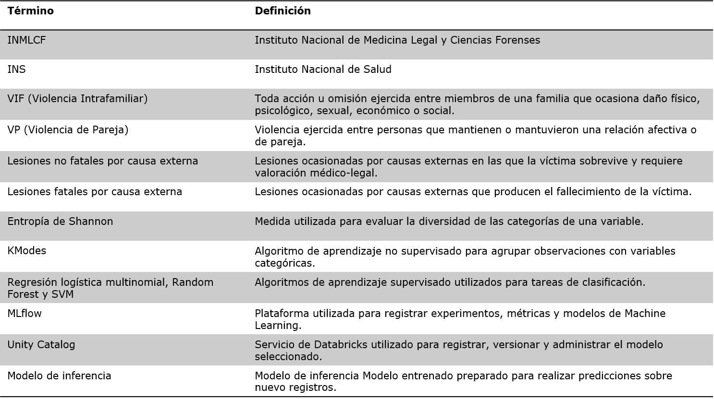
 |

### 3. Contexto

De acuerdo con el Instituto Nacional de Salud (INS), la violencia intrafamiliar y de pareja 
constituye un evento de interés en salud pública en Colombia, registrándose centenas de miles de casos cada año.
En lo corrido del año, con corte a julio de 2026, el INS reportó 83.045 casos de este tipo de violencia, 
de los cuales la violencia física representó el 47,55 % (39.488 casos).

No todos los casos de violencia física son denunciados ante una autoridad competente 
(Fiscalía General de la Nación, Policía Nacional o Comisarías de Familia); por lo tanto, 
una proporción de estos eventos no es conocida por el Instituto Nacional de Medicina Legal y Ciencias Forenses (INMLCF).

Según los registros históricos del INMLCF para el periodo 2015–2024, se reportaron 236.840 casos 
de violencia intrafamiliar, 438.786 casos de violencia de pareja y 3.010 homicidios asociados a estos eventos.

En el contexto colombiano, actualmente se registran y publican estadísticas relacionadas 
con la violencia intrafamiliar y de pareja (INS e INMLCF, 2026); sin embargo, 
no se identificó evidencia de aplicaciones basadas en modelos de aprendizaje automático orientadas 
a predecir el nivel de peligro de muerte en víctimas de violencia intrafamiliar y de pareja (Muñoz et al., 2023).

### 4. Objetivo general

Desarrollar una metodología basada en modelos de Machine Learning que permita 
predecir el nivel de peligro de muerte en víctimas de violencia intrafamiliar y violencia de 
pareja mediante la integración de técnicas de aprendizaje no supervisado y supervisado 
sobre información del Instituto Nacional de Medicina Legal y Ciencias Forenses (INMLCF).

### 5. Objetivos específicos

-Preparar e integrar la información del Instituto Nacional de Medicina Legal y Ciencias Forenses 
para garantizar la calidad de los datos utilizados durante el proceso de modelado.

-Realizar el análisis exploratorio de los datos y las pruebas estadísticas necesarias 
para caracterizar la población objeto de estudio.

-Identificar grupos homogéneos de víctimas no fatales mediante el algoritmo KModes y 
construir el centroide representativo del grupo de víctimas fallecidas.

-Definir niveles de peligro a partir de la proximidad entre los centroides obtenidos, 
generando la variable objetivo para el modelo supervisado.

-Construir diferentes escenarios de balanceo para abordar el desbalance de clases presente en el conjunto de datos.

-Entrenar y comparar modelos de Regresión Logística Multinomial, Random Forest y Máquinas de Vectores de Soporte (SVM).

-Seleccionar el modelo con mejor desempeño mediante la comparación de métricas de evaluación, 
priorizando su capacidad para identificar correctamente los casos clasificados con mayor nivel de peligro.

-Registrar el modelo seleccionado en MLflow utilizando Unity Catalog, dejándolo disponible 
para su posterior despliegue.

### 6. Metodología

La metodología se desarrolla en dos fases. La primera construye 
la variable objetivo mediante técnicas de aprendizaje no supervisado; la segunda entrena y selecciona 
un modelo supervisado para predecir el nivel de peligro en nuevos casos.

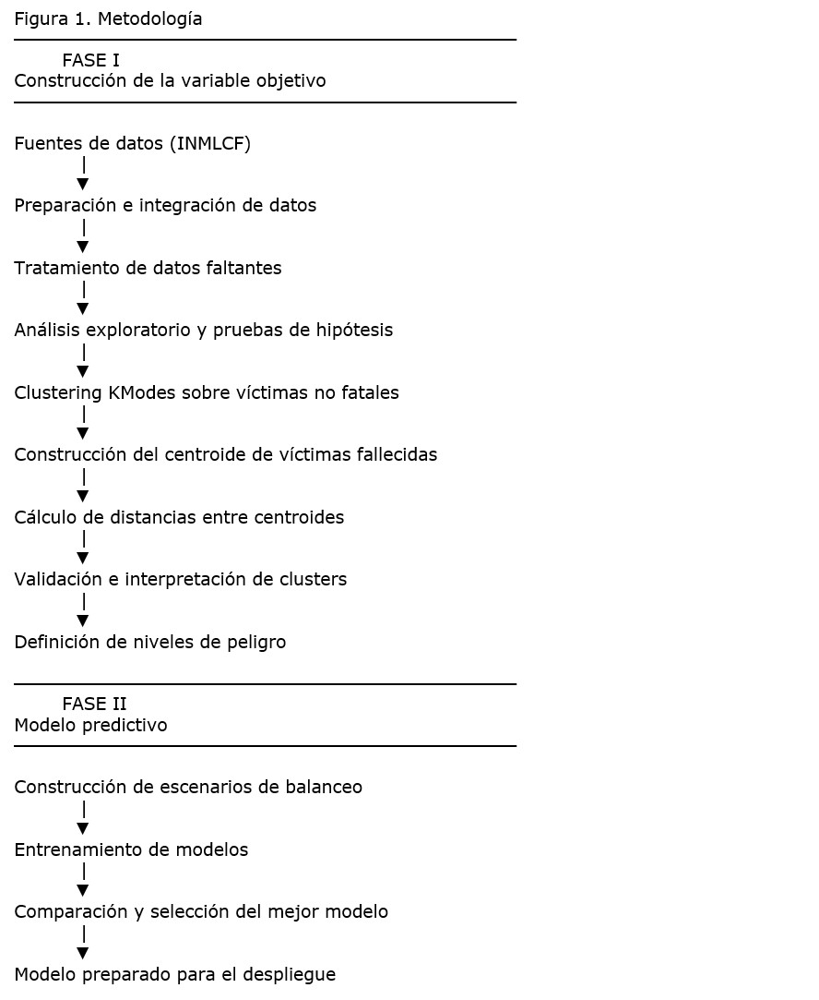

### 7. Arquitectura de la solución

La arquitectura de la solución está compuesta por dos capas complementarias. 
La primera corresponde a la arquitectura técnica implementada en Databricks 
para el procesamiento de datos, entrenamiento y gestión del modelo mediante MLflow y Unity Catalog.
 La segunda corresponde a la arquitectura documental del proyecto, implementada en GitHub,
 donde se organiza la documentación, los notebooks y las evidencias que garantizan la trazabilidad 
y reproducibilidad metodológica.

Figura 2. Arquitectura de la solución

Capa superior: Arquitectura técnica (INMLCF → Databricks → MLflow → Modelo → Aplicación futura).

Capa inferior: Arquitectura documental (GitHub → README → Notebooks → Documentación → Evidencias).

### 8. Organización del repositorio

Figura 3. Organización del repositorio

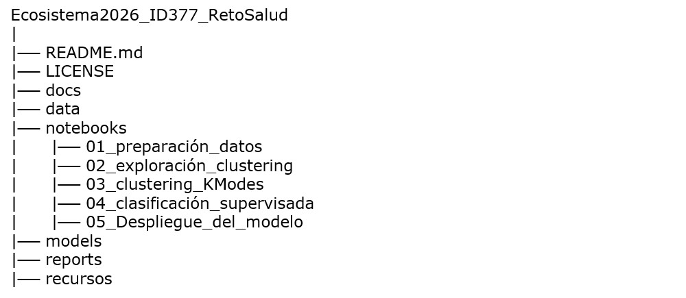

### 9. Tecnología usadas

Tabla 2. Tecnologías usadas

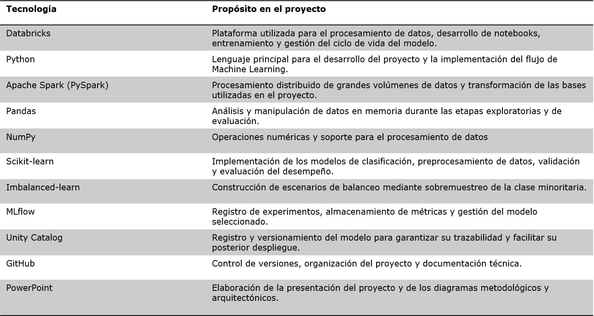

### 10. Datos utilizados

Para el desarrollo del proyecto se utilizaron bases de datos publicadas 
en el portal **Datos Abiertos Colombia** y bases de datos derivadas suministradas 
por el **Instituto Nacional de Medicina Legal y Ciencias Forenses de Colombia (INMLCF)**.

### 10.1 Bases de datos de Datos Abiertos Colombia

Se emplearon las siguientes bases de datos públicas:

1. **Violencia intrafamiliar. Colombia, años 2015 a 2024. Cifras definitivas**, 
compuesta por **236.840 registros** y **35 variables categóricas**.

https://www.datos.gov.co/Justicia-y-Derecho/Violencia-intrafamiliar-Colombia-a-os-2015-a-2024-/ers2-kerr/about_data

2. **Lesiones por Violencia de Pareja en Colombia. Histórico 2015 a 2024**, compuesta por **438.786 registros** 
y **35 variables categóricas**.

https://www.datos.gov.co/Justicia-y-Derecho/Lesiones-por-Violencia-de-Pareja-en-Colombia-Hist-/9fs6-37ea/about_data

Estas bases fueron utilizadas para:

a. Identificar las **35 variables categóricas** que caracterizan a las víctimas de violencia intrafamiliar (VIF) y 
violencia de pareja (VP).

b. Determinar las necesidades de preparación de los datos, incluyendo el tratamiento de valores nulos, 
categorías "Sin información", estandarización de nombres de columnas y homologación de categorías.

c. Analizar la distribución de las variables mediante estadísticas descriptivas y visualizaciones, 
con el fin de evaluar la conveniencia de incorporar una variable que segmentara los casos según 
el contexto del hecho en:

* Violencia contra niños, niñas y adolescentes.
* Violencia contra el adulto mayor.
* Violencia entre otros familiares.
* Violencia de pareja.

Las anteriores bases de datos son un subconjunto de la data de lesiones no fatales por causa externa (2015–2024)
utilizada por INMLCF para construir las siguientas bases derivadas.

### 10.2 Bases de datos derivadas

Posteriormente, el proyecto utilizó dos bases de datos derivadas construidas 
a partir del cruce entre la base de **lesiones no fatales por causa externa (2015–2024)** 
y la base de **lesiones fatales por causa externa (2015–junio de 2026)**, 
mediante el número de identificación anonimizado de las víctimas.

#### Grupo 1: No fatales

Este grupo corresponde a víctimas con antecedentes de violencia intrafamiliar
o violencia de pareja que **no presentan coincidencia** con registros de lesiones fatales 
por causa externa en el período analizado.

Para su construcción se realizó el cruce entre ambas bases utilizando el identificador 
anonimizado de la víctima. Posteriormente, se conservaron únicamente los registros 
sin coincidencia en la base de lesiones fatales y
se filtraron aquellos cuyo **Contexto del Hecho** correspondía a:

* Violencia contra niños, niñas y adolescentes.
* Violencia contra el adulto mayor.
* Violencia entre otros familiares.
* Violencia de pareja.

La base resultante está compuesta por **675.401 registros** y **41 variables categóricas**.

#### Grupo 2: Muerte

Este grupo corresponde a víctimas que presentan registros tanto en la base de lesiones 
no fatales por causa externa como en la base de lesiones fatales por causa externa.

Inicialmente se identificaron **225 registros coincidentes** entre ambas bases y 
se filtraron aquellos cuyo **Contexto del Hecho** correspondía a:

* Violencia contra niños, niñas y adolescentes.
* Violencia contra el adulto mayor.
* Violencia entre otros familiares.
* Violencia de pareja.

Posteriormente, se seleccionaron únicamente los casos 
cuya **Manera de muerte definitiva** correspondía a **Homicidio**, 
obteniendo el segundo grupo de interés del proyecto: víctimas con 
antecedentes de violencia intrafamiliar o violencia de pareja que posteriormente fallecieron por homicidio.

La base final está conformada por **101 registros** y **70 variables categóricas**.

Las bases de datos derivadas fueron suministradas por el 
**Instituto Nacional de Medicina Legal y Ciencias Forenses (INMLCF)**. 
Debido a que el identificador de las víctimas corresponde a un dato anonimizado 
y las bases se entregaron bajo condiciones de uso específicas, estas **no se incluyen en este repositorio**, 
ya que actualmente no se cuenta con autorización formal para su distribución.

### 11. Flujo del proyecto

El desarrollo del proyecto siguió la metodología **CRISP-DM (Cross-Industry Standard Process for Data Mining)**, 
un estándar ampliamente utilizado para el desarrollo de proyectos de minería de datos y aprendizaje automático. 
Esta metodología proporciona un enfoque estructurado e iterativo que permite comprender el problema, 
preparar los datos, construir modelos, evaluarlos y desplegarlos para su utilización.

En este proyecto, las actividades desarrolladas se alinean con las fases de CRISP-DM de la siguiente manera:

Tabla 3. Flujo del proyecto

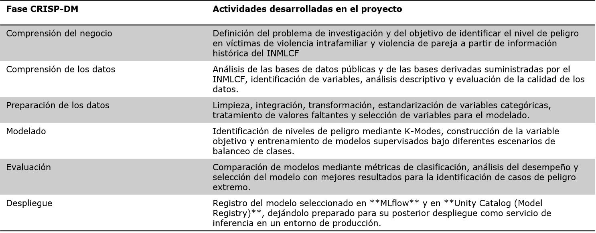

### 12. Resultados principales

Como resultado del desarrollo del proyecto se obtuvieron los siguientes productos y hallazgos principales:

   1. **Construcción de los grupos de estudio.**

   Se conformaron dos grupos de interés a partir del cruce entre las bases de lesiones no fatales y
   fatales por causa externa suministradas por el Instituto Nacional de Medicina Legal y Ciencias 
   Forenses de Colombia (INMLCF):

   * **Grupo no fatales:** 675.401 registros correspondientes a víctimas de violencia intrafamiliar 
	y violencia de pareja sin coincidencia con registros de lesiones fatales por causa externa 
	durante el período analizado (2015–junio de 2026). En el tratamiento de datos faltantes 
	se reduce el número de casos, a un total de 643291 casos.

   * **Grupo muerte:** 101 registros correspondientes a víctimas con antecedentes de violencia 
       intrafamiliar o violencia de pareja cuya manera de muerte definitiva fue clasificada como homicidio.

  2. **Caracterización de las víctimas.**

  Del análisis exploratorio, en la primera fase de comparaciòn de las 33
  variables por observación, se encuentra diferencias entre grupos en 13
  de ellas (Tabla 4). 

Tabla 4. Variables con diferencias entre grupos 
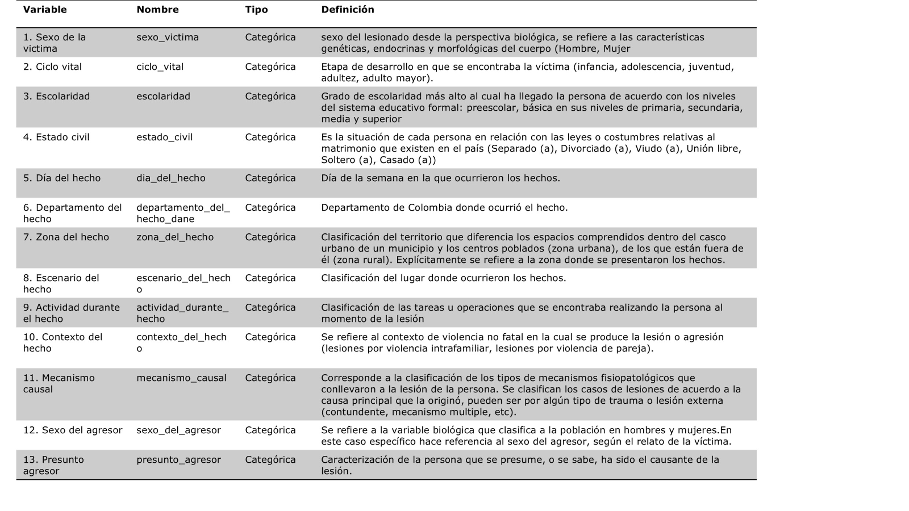

En la segunda fase se aplica el estadístico de prueba Chi-cuadrado, con un nivel de confianza del 95%, para establecer si se rechaza la hipótesis nula seguiente:

	H0: no hay diferencias significativas entre las características del grupo víctimas 
	previas de VIF-VP y su posteriormente muerte por violencia de esta naturaleza (muerte) y 
       el grupo que experimentó VIF-VP y está viva (no fatales).

	Ha: si hay diferencias significativas entre las características del grupo 
	víctimas previas de VIF-VP y su posteriormente muerte por violencia de esta naturaleza (muerte) 
        y el grupo que experimentó VIF-VP y está viva (no fatales).

  Se rechaza la hipótesis nula, hay diferencias entre grupos en 7 características: sexo de la victima,
  ciclo vital, escolaridad, estado civil, contexto del hecho, mecanismo causal y presunto agresor (Tabla 5).
    	 
Tabla 5. Resumen de la prueba Chi-cuadrado 

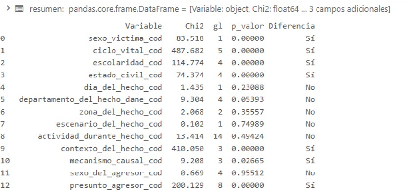

3. **Identificación de niveles de peligro mediante aprendizaje no supervisado.**

   Se evidencia una estructura heterogénea en el grupo de víctimas no fatales que justifican la aplicación de un algoritmo de agrupamiento para datos    categóricos como K-Modes, teniendo en cuenta que se encuentran: 
   4234 perfiles distintos, 151.93 promedio de personas por perfil, variables con mayor diversidad: mecanismo_causal_cod, escolaridad_cod y presunto_agresor_cod, con entropía normalizada,  0.892, 0.8275 y 0.8029, respectivamente, ariable con menor diversidad: estado_civil_cod,    con entropía normalizada: 0.6893. y Mayor asociación encontrada: ciclo_vital_cod y Contexto del hecho V de Cramér = 0,7356. 
  
   Encontrando heterogéneidad en el grupo de víctimas no fatales, se aplica la técnica de agrupamiento
   K-modes con 2,3,4, 5 y 6 clusters (Tabla 6). 

Tabla 6. Criterios de decisiòn clusters 2,3,4,5 y 6.
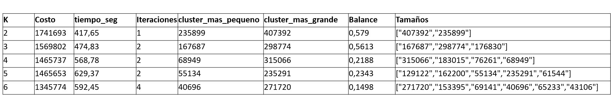

   De acuerdo a los criterio de decisión, medidas costo (disimilitud intra-cluster) y 
   balance (representa el % del cluster más pequeño sobre el más grande) e iteraciones, se selecciona K=3.
   
   Teniendo en cuenta que la diferencia del costo (disimilitud intra-cluster) es mayor cuando 
   se pasa del cluster 2 al 3. Adicionalmente el balance es de 0.5613, esto quiere decir, 
   que el cluster más pequeño representa 56.13% del más grande, esto garantiza que no se formen agrupaciones
   muy pequeñas, que no contribuya a definir un perfil. Por otra parte, 
   el algoritmo K-Modes convergió en dos iteraciones. Esto indica que, 
   tras dos ciclos de asignación de los individuos y la actualización de los centroide de los clusters,
   la composición de los grupos se estabilizó y no se observaron mejoras adicionales en la función de costo. 
   En consecuencia, los tres centroides obtenidos representan la solución estable alcanzada 
   por el algoritmo para esa ejecución.

  
  Posteriormente, se halla el centroide para el grupo muerte que consiste en hallar la moda
  de cada una de las siete variables.

  En la tabla 7, se resume las características de los centroides de cada uno de los 3 clusters del grupo no fatales, etiquetados como 0, 1 y 2. y del centroide del cluster muerte, etiquetado como -1. 

Tabla 7. Centroides de los 3 clusters (0,1,2) del grupo no fatales y del cluster del grupo muerte (-1)
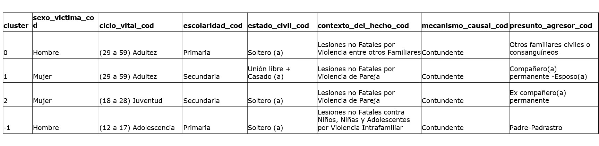

En función a las distancias entre centroides (tabla 8), y el porcentaje de representatividad de los casos segun las características del centroide  (tabla 9),

Tabla 8. Distancias entre centroides
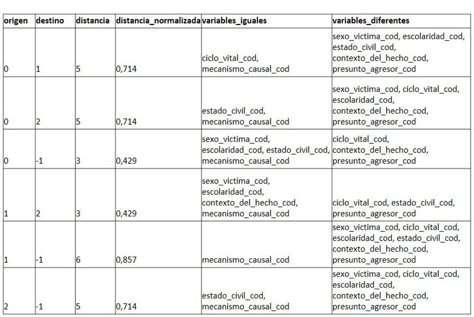

Tabla 9. % de representatividad de los casos segun las características del centroide
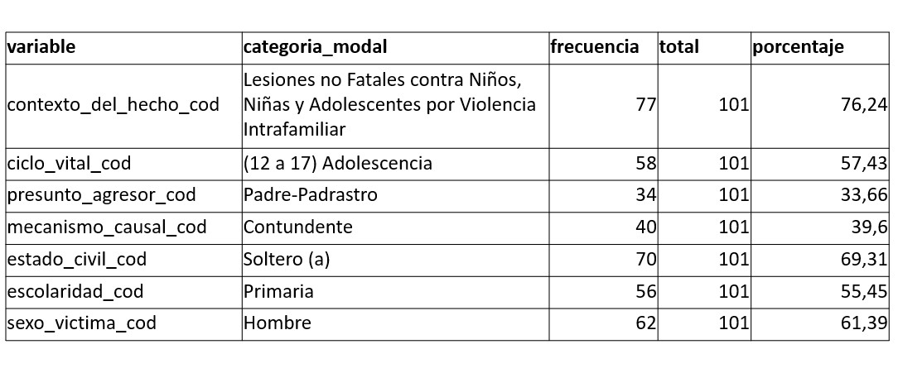

se encuentran los siguientes perfiles por cluster y etiquetan los clusters no fatales 
según la distancia al cluster muerte:

-El cluster -1 que representan los casos donde las victimas mueren, se etiquetará "Peligro extremo", Tamaño del grupo = 101 casos. 

Este grupo tiene una homogeneidad alta, teniendo en cuenta que la representación de los casos segun las categorias del centroide estan entre 55.45% a 76.24% para 5 variables, contexto del hecho (76.24%), estado civil (69.31%), sexo (61.39%), ciclo vital (57.43%) y escolaridad (55.45%). Por otra parte el grupo peligro grave, es mas diverso en relación a las características mecanismo causal (39.6%)
 y presunto agresor (33.6%).

-El cluster 0: este cluster tiene una homogeneidad moderada, teniendo en cuenta que la representación del los casos segun las categorías del centroide esta entre 44.25% a 58.69% para las variables sexo, escolaridad, estado civil, mecanismo causal, contexto del hecho y ciclo vital. Entre las cuatro primeras variables anteriores, están las coincidentes con el cluster -1 de muerte.

Adicionalmente, este es el cluster más cercano al cluster -1 con una distancia de 3 variables diferentes . 
Por lo tanto, este cluster se etiquetará "Peligro Grave". Tamaño del grupo = 167687 casos

-El cluster 2: tiene una homogeneidad alta, teniendo en cuenta que la representación de los casos segun las categorías del centroide esta entre 62.6% a 83.34%, exceptuando la variable mecanismo causal (49.26%).

Adicionalmente difiere en 5 variables con el cluster -1, por lo tanto, se etiquetará con "Peligro Moderado". 
Tamaño del grupo = 176830 casos.

-El cluster 1: tiene una homogeneidad alta, teniendo en cuenta que la representación del los casos 
segun las categorías del centroide esta entre 50.42% a 88.63% para todas las variables. Por otra parte, este cluster es el más lejano al cluster -1, con distancia de 6 variables diferentes. Por lo tanto, este cluster se etiquetará "Peligro Bajo".

los centroides de los clusters 1 y 2 difieren en 3 variables; ciclo vital, estado civil y presunto agresor (D). 
Tamaño del grupo = 298774 casos

Cabe resaltar que al comparar el cluster peligro grave con el alto, moderado y bajo, las 5 variables; 
contexto del hecho, estado civil, sexo, ciclo vital y escolaridad, son más determinantes para establecer que un individuo pertenece o no a otro grupo.

4. **Construcción de la variable objetivo.**

se integra las bases de datos de casos no fatales y de muerte, en una sola base de datos. 
En la cual se identifica, cada uno de los casos que integran los 4 clusters en: peligro bajo (1), moderado (2), grave(0) y extremo (-1) de muerte por VIF o VP. Cada uno de estos grupos tiene un tamaño de 298774, 176830, 167687, 101 casos respectivamente.

5. **Entrenamiento y evaluación de modelos de clasificación.**

   Se evaluaron diferentes algoritmos de aprendizaje automático bajo múltiples escenarios    de balanceo de clases de manera experimental (500, 1000 y 2000, tabla 10) sobre el dataset de entrenamiento para identificar el modelo con mejor capacidad de clasificación.
 
Tabla 10. Balanceo de la clase minoritaria peligro extremo para cada uno de los 3 escenarios experimentales.
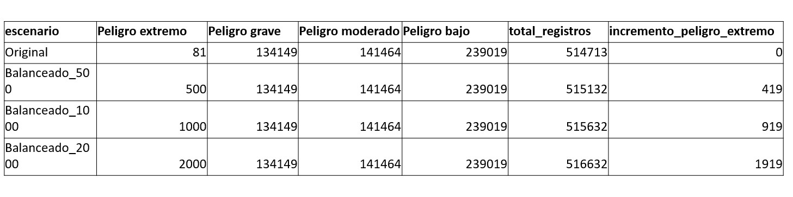

Adicionalmente, para cada escenario  se calcula sus propios pesos de clase (tabla 11). Esto permitirá que los modelos den mayor importancia a las clases minoritarias.

Tabla 11. Pesos de clases según escenarios
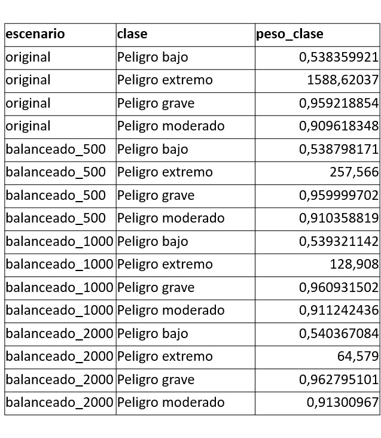

Los pesos se calculan con:
 pesoi = N / (K * nᵢ)

 N = número total de registros del escenario. K = número de clases. nᵢ = número de registros de la clase i.

 Por eso, las clases frecuentes tienen pesos cercanos a 1.  Las clases poco representadas tienen pesos mayores. 
 El modelo penaliza más los errores cometidos sobre clases minoritarias. 
 
 La selección del mejor modelo, entre los modelos de regresión logística multinomial,  Random Forest y máquina de vectores soporte (SVM), los cuales incluyen 4 escenarios,  para un total de 12  evaluaciones de desempeño (Tabla 12).   

Tabla 12. Resumen de las mètricas de desempeño por modelo      

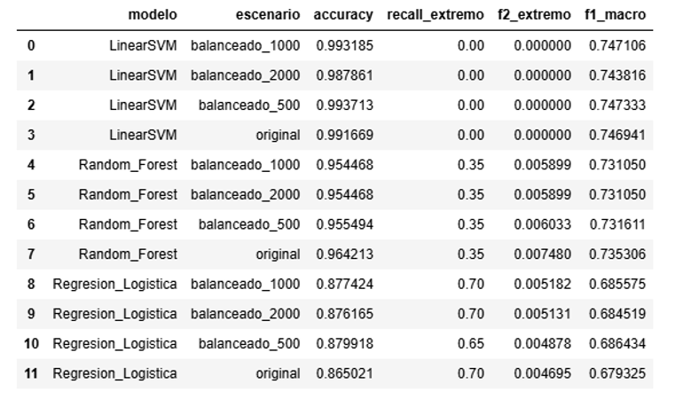

La selección del modelo se realizó mediante una evaluación jerárquica de múltiples métricas de desempeño.
En primer lugar, se priorizó el Recall de la clase Peligro extremo, dado que el objetivo principal del estudio es maximizar la identificación de los casos de mayor riesgo. 

Posteriormente, se consideró el F₂-Score de esta clase, por otorgar mayor importancia al Recall sin descuidar completamente la Precisión. 

Como criterios complementarios se analizaron el F1-Score y el Accuracy macro o global, con el propósito de seleccionar un modelo con un desempeño equilibrado tanto en la clase crítica
como en el conjunto de clases.

### 13. **Modelo seleccionado**

   El modelo de **Regresión Logística Multinomial**, entrenado bajo el escenario de balanceo 
   con **1.000 registros** para la clase minoritaria, 
   presentó el mejor desempeño de acuerdo con los criterios de evaluación establecidos y 
   fue seleccionado como modelo final del proyecto (Tabla 13).   
 
Tabla 13. Resumen de las mètricas de desempeño del mejor modelo

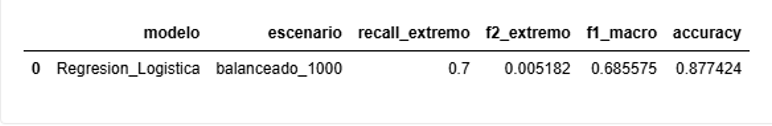

La matriz de confusión multiclase normalizada(figura 4) del mejor modelo, indica que el 70% de los casos de clase peligro extremo, el 70.8% de la clase peligro grave, el 97.4% de clase peligro moderado y el 91.5% de la clase peligro bajo fueron predichos correctamente. Por lo tanto, este modelo tiene una buena capacidad de clasificación.

Por otra parte, en la matriz de confusión multiclase (figura 5), se observa que el 28.6% (9593 casos) de la clase peligro grave son predichos en peligro extremo. Lo cual es positivo en el sentido, de que es mejor que el modelo genere falsas alarmas de la clase más cercana al peligro extremo, a que pierda capacidad de detectar casos reales de peligro extremo.

Figura 4. Matriz de confusión multiclase normalizada del mejor modelo

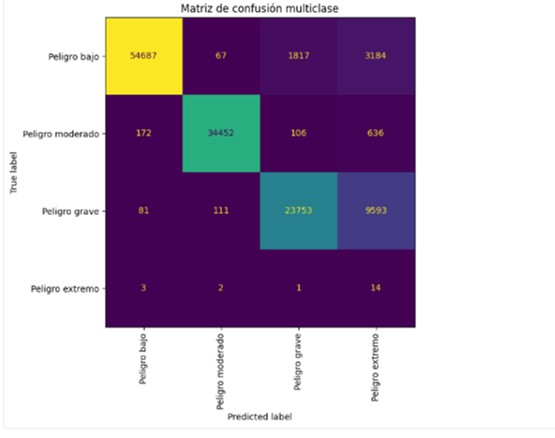

Figura 5. Matriz de confusión multiclase del mejor modelo

### 14. **Registro del modelo.**

  El modelo seleccionado fue registrado en **MLflow** y 
  posteriormente en **Unity Catalog (Model Registry)** de Databricks, 
  quedando preparado para su despliegue como servicio de inferencia en un entorno de producción.

Figura 6. Registro del mejor modelo en MLflow

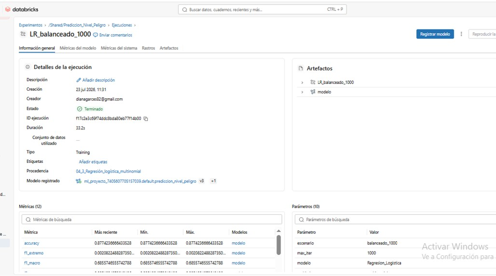

Figura 7. Registro del mejor modelo en el catàlogo de Databricks

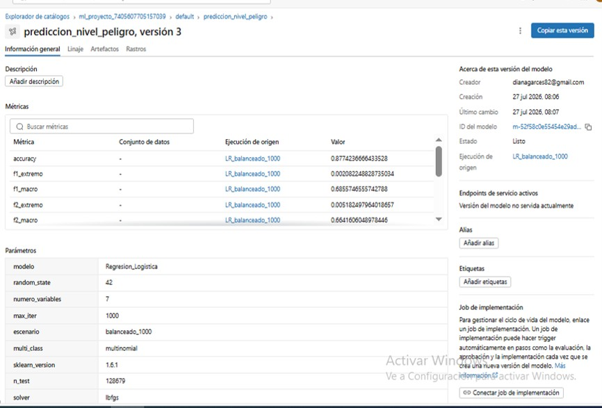

En conjunto, estos resultados demuestran la viabilidad de combinar técnicas de aprendizaje no supervisado y supervisado para construir un modelo capaz de clasificar el nivel de peligro de nuevos casos de violencia intrafamiliar y violencia de pareja, utilizando información histórica proveniente del Instituto Nacional de Medicina Legal y Ciencias Forenses de Colombia.

### 15. Impacto social

El proyecto tiene el potencial de contribuir a la prevención de casos fatales de violencia intrafamiliar y violencia de pareja.

Adicionalmente, priorizar la atención de las instituciones (policia, líneas de atención a la víctima, etc) 
y la aplicación de protocolos, concordantes con la clasificación del nivel de peligro. Lo cual permitirá
reducir la violencia intrafamiliar y de pareja en el tiempo. Teniendo en cuenta, como se dice en el Forensis del año 2006 del INMLC, en el capítulo de violencia intrafamiliar, esta "afecta la unidad familiar porque la violencia es un patrón de interacción transmitido de generación en generación." 

Por otra parte, ampliar el análisis no solo a la violencia física en el contexto VIF y VP, sino a otros 
tipos de violencia como la violencia sexual y violencia psicológica. Los cuales lleva estadísticas el INS, logrando un acuerdo interinstitucional entre INS y INMLC, para cruzar otras tipos de violencia VIF y VP con la base de lesiones fatales de causa externa.

Posteriormente, este proyecto se puede extender a casos de intento de suicidio y suicidio. 

### 16. Demostración del proyecto

Para visualizar el funcionamiento completo del proyecto, desde el desarrollo en Databricks hasta el registro del modelo en MLflow y Unity Catalog, se dispone del siguiente video demostrativo.

🎥 Demo del proyecto

[Demo de proyecto](https://youtu.be/plCGHURBgCU).

En el video se presenta:

La organización del proyecto en Databricks.
La ejecución de los notebooks.
El entrenamiento de los modelos.
El seguimiento de experimentos mediante MLflow.
La comparación de modelos.
El registro del modelo seleccionado en Unity Catalog.
La preparación del modelo para su posterior despliegue.

### 17. Cómo recorrer el repositorio

El proyecto se encuentra organizado de forma secuencial para facilitar su comprensión y reproducibilidad. 
Se recomienda revisar el contenido en el siguiente orden:

Tabla 14. Orden de recorrido del repositorio

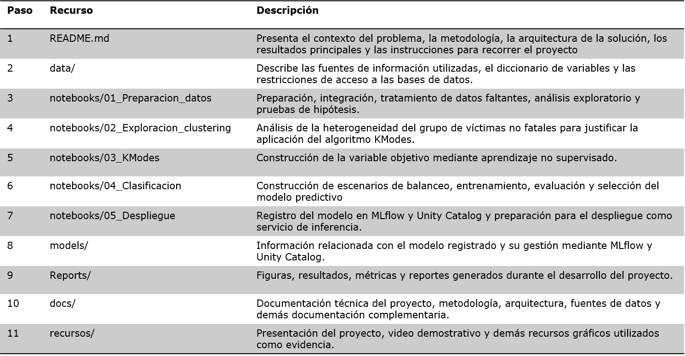

### 18. Autores

Diana Liceth Garcés Portilla
Ing. Industrial -Magister en Ciencia de Datos

Guillermo Rincón Velandia
Economista

### 19. Referencias Bibliográficas

1. Hastie, T., Tibshirani, R., & Friedman, J. (2009). *The Elements of Statistical Learning: Data Mining, Inference, and Prediction* (2nd ed.). Springer.

2. IBM. (s. f.). *CRISP-DM (Cross-Industry Standard Process for Data Mining)*. https://www.ibm.com/docs/es/spss-modeler/saas?topic=dm-crisp-help-overview

3. Instituto Nacional de Medicina Legal y Ciencias Forenses (INMLCF). (s. f.). *Observatorio de Violencia*. https://www.medicinalegal.gov.co/observatorio

4. Instituto Nacional de Salud (INS). (2026). *Sistema de vigilancia en salud pública: Violencia intrafamiliar y de pareja*. https://app.powerbi.com/view?r=eyJrIjoiYzdkZjdkNDAtMDI5Zi00NGU2LTg1ZjktYTQxYmFhMjUwMzEyIiwidCI6ImE2MmQ2YzdiLTlmNTktNDQ2OS05MzU5LTM1MzcxNDc1OTRiYiIsImMiOjR9

5. Muñoz, et al. (2023). *Aprendizaje automático aplicado a la violencia de género: un estudio de mapeo sistemático*. Revista Colombiana de Estadística. https://www.scielo.org.co/scielo.php?script=sci_arttext&pid=S0121-11292023000200005

### 20. Licencia 

Este proyecto se distribuye bajo la Licencia MIT. Consulte el archivo LICENSE para conocer los términos completos de la licencia.

